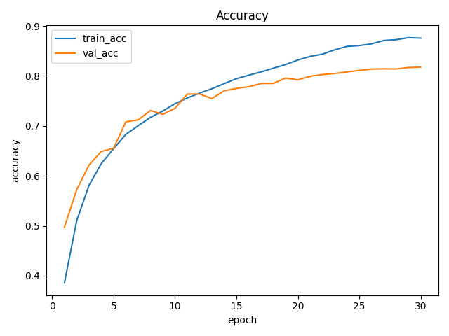
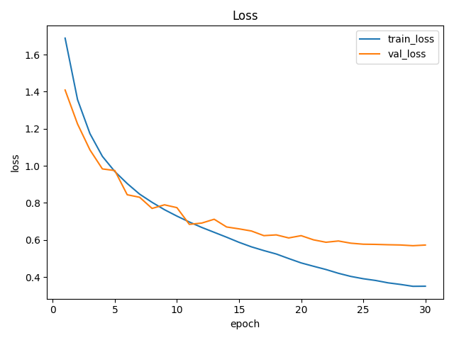
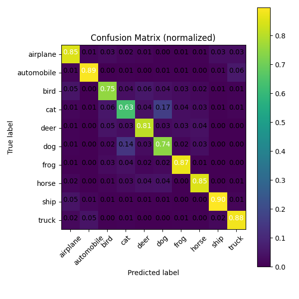

# 🧠 Self-Distillation Project — 自蒸馏技术在小模型训练中的应用研究

> ✍️ 作者：黄佳豪  
> 🏫 莆田擢英中学初中部 C231116  
> 📄 论文原文：[自蒸馏技术在小模型训练中的应用研究.docx](https://github.com/user-attachments/files/22950286/default.docx)

---

## 📌 研究背景

传统的知识蒸馏（Knowledge Distillation）依赖一个庞大的教师模型来指导小模型的学习。  
而**自蒸馏**跳过了教师模型这一步，让学生“向自己学习”，大幅简化了蒸馏流程，并起到正则化作用。

✅ 优势包括：
- 🚀 提升小模型泛化性能  
- ⚡ 不增加推理开销  
- 🧠 缓解过拟合  
- 📊 易于部署与迁移

---

## 🧪 实验配置

- **数据集**：CIFAR-10  
- **模型结构**：ResNet-18（小模型）  
- **训练轮数**：30 epochs  
- **优化器**：SGD (momentum=0.9, weight_decay=5e-4)  
- **蒸馏温度 T**：4  
- **损失函数**：交叉熵 + KL 散度蒸馏损失  
- **蒸馏权重 α**：0.5  

---

## 📊 实验结果

| 模型                  | Top-1 准确率 | 验证损失 | 训练-验证精度差 |
|-----------------------|-------------|----------|-----------------|
| Baseline              | 81.7%       | 0.573    | ≈6%             |
| Self-Distillation     | 82.1%       | 0.538    | ≈4%             |

- 自蒸馏模型在验证集上准确率提高了 **0.4%**  
- 损失更低，训练曲线与验证曲线更接近，泛化能力更强  
- 在猫狗、鹿马等易混类别上的识别准确率略有提升

---

## 📈 可视化结果

### Baseline
  

### 自蒸馏
  

### 混淆矩阵对比
| Baseline | Self-Distillation |
|----------|-------------------|
|  |  |

---

## 📂 项目结构
selfdistill-project/
├── baseline_importance/
│   ├── baseline_config.json
│   ├── baseline_confmat_best.png
│   ├── baseline_curves_acc.png
│   ├── baseline_curves_loss.png
│   ├── baseline_history.csv
│   └── train_log_baseline.txt
├── selfdistill_importance/
│   ├── selfdistill_config.json
│   ├── selfdistill_confmat_best.png
│   ├── selfdistill_curves_acc.png
│   ├── selfdistill_curves_loss.png
│   ├── selfdistill_history.csv
│   └── train_log_selfdistill.txt
├── VSC图片/
├── README.md
└── train.py
---

## 📜 引用 / Citation
@article{huang2025selfdistill,
title={自蒸馏技术在小模型训练中的应用研究},
author={黄佳豪},
year={2025},
journal={Project Report},
url={https://github.com/JiahaoAlbus/selfdistill-project}
}
📄 论文下载：[自蒸馏技术在小模型训练中的应用研究.docx](https://github.com/user-attachments/files/22950303/default.docx)

---

## 📬 联系方式

- **Email:** jiahao15345932820@gmail.com  
- **GitHub:** [@JiahaoAlbus](https://github.com/JiahaoAlbus)

---

## ⭐ 支持项目

如果你觉得这个项目对你有帮助，请点个 **Star ⭐** 鼓励我！

## 🚀 从零开始快速运行（支持 Windows / macOS / Linux）
# 1. 克隆项目
git clone https://github.com/JiahaoAlbus/selfdistill-project.git
cd selfdistill-project

# 2. 创建虚拟环境
# 👉 Windows
python -m venv venv
venv\Scripts\activate

# 👉 macOS / Linux
python3 -m venv venv
source venv/bin/activate

# 3. 升级 pip 并安装依赖
pip install --upgrade pip
pip install -r requirements.txt

# 4. 运行训练脚本
python train.py
